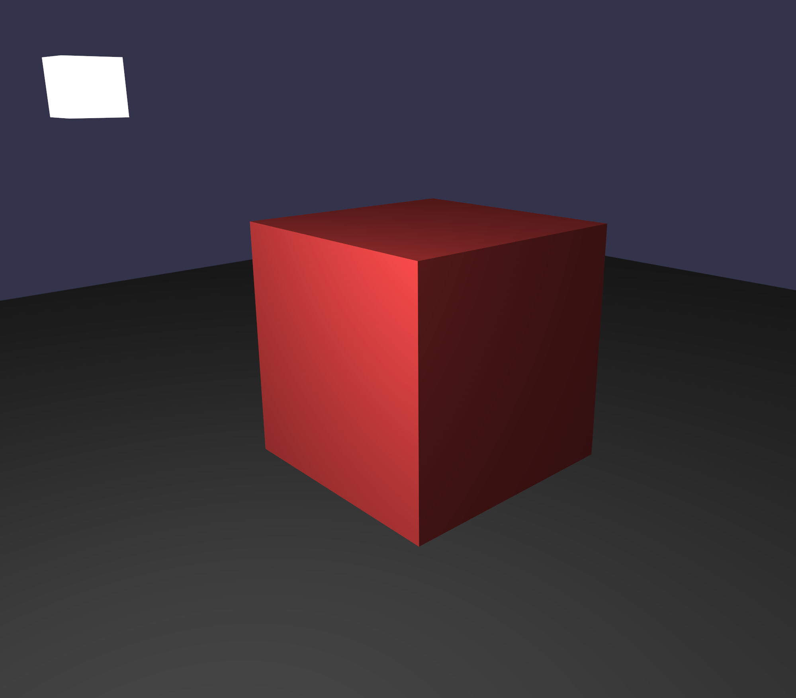

# Enigma
> 🎮 A game engine written in C++ using modern OpenGL

## Purpose
The general purpose of this project started out as a way to learn OpenGL and C++, but has graduated into a more extensive project. While the project may not be maintained to the highest degree, I will be pushing updates regulary, adding features and functionality to flesh out the engine. Right now, however, I will be treating this as a way to experiment with the more advanced features of OpenGL and abstract them to learn about game engine development.

> Note: To start off, the code was copied over from one of my other working repositories. If you see a huge initial commit, that is why.

## Features
The main features of this engine include...
+ Abstraction of core OpenGL features
    + VBOs
    + VAOs
    + EBOs
    + Shaders
    + Textures
    + etc.
+ **Renderer**, **Manager** and **Window Manager** classes that help manage the game instance
+ Abstractions of objects into classes that can be declared and positioned easily in the 3D world
+ Lighting features and shaders that use them
    + There are also unlit versions of shaders if lighting isn't desired

...as well as some others, but those are the core features. There may be additional functionality added later in development, like a GUI interface for creating and positioning objects, but ultimately the engine will focus more on making it easy to work with OpenGL by providing a simplified interface in C++, and not much more. There are currently no plans to add the following directly to the engine:
+ Player controllers
+ Terrain generation
+ Movable entities
+ Cloth or fluid simulations
+ Global illumination

If you wish to have these features, you should code them yourself while using `Enigma` as a base, as that is what the project is intended to serve as.

## Usage
`Enigma` is designed on and for usage on the GNU/Linux desktop. If you wish to make a port of the project to an implementation on Windows or the MacOS, feel free to do so. Because the engine is being designed on GNU/Linux, you will need to use `gcc` or some other compiler to compile the program (the provided build file uses `g++`). To debug the project, it is recommended to use `gdb`.

Currently the entire project is directory-dependent, and the file structure must be exactly as it is in the repo. This will likely change in the future, as it is difficult to maintain a project dependent on file structure. For now, the binary must be placed in the root folder of the project, and everything in `src/` must remain in the same position relative to each other. The `res/` directory contians some sample items.

The `src/Application.cc` file contains most of what you need to learn how to use the engine, but a more detailed guide will eventually be available on the wiki of this repo.

## About
I am a 17-year-old programmer who wants to make games and game engines.

If you want to contact me (for whatever reason), my contact info is here:

| Type      | Information                          |
|-----------|--------------------------------------|
| Email     | cadenhenrich [at] gmail [period] com |
| Discord   | Nohmayne [hash] 7227                 |
| Instagram | [at] am_cursed                       |

### License

This project is licenced under `GNU GPLv3`. See the `LICENSE` file for further information.
